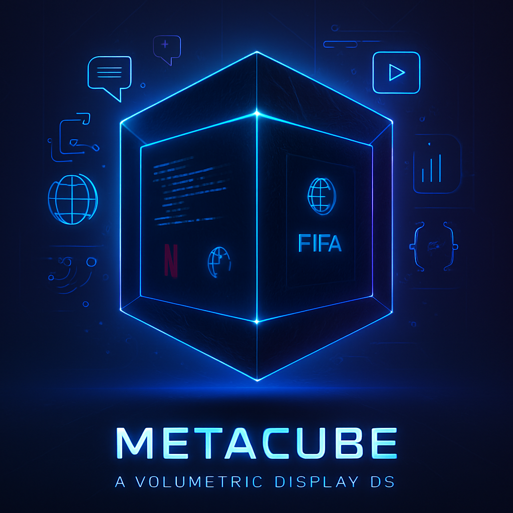

  

# MetaCube – A Programmable Black Volumetric Display

**Inventor:** Dhruv Pachnanda  
**Date:** June 20, 2025  
**Location:** Dehradun, India  

---

## What is MetaCube?

MetaCube is a revolutionary black volumetric display that floats in mid-air using light and metamaterials — without any screen. It’s programmable, interactive, and can display everything from Netflix to AI interfaces and FIFA in a floating, freestanding form.

---

### 🔑 Key Features

- Appears as a floating black cube or void in space  
- Runs apps, games, videos in real-time (Netflix, FIFA, AI, OS)  
- Uses light-absorbing metamaterials and field projection  
- Interacts via gestures, neural control, or AI  
- Intended for future "Spatial OS" environments  

---

### 🧠 Inventor Declaration

This repository is timestamped proof of invention.  
I, **Dhruv Pachnanda**, claim original authorship of this concept.  
This idea has not been derived from any paper or existing product.  

📩 dhruvpachnanda276@gmail.com  
🗓️ Declared: June 20, 2025
